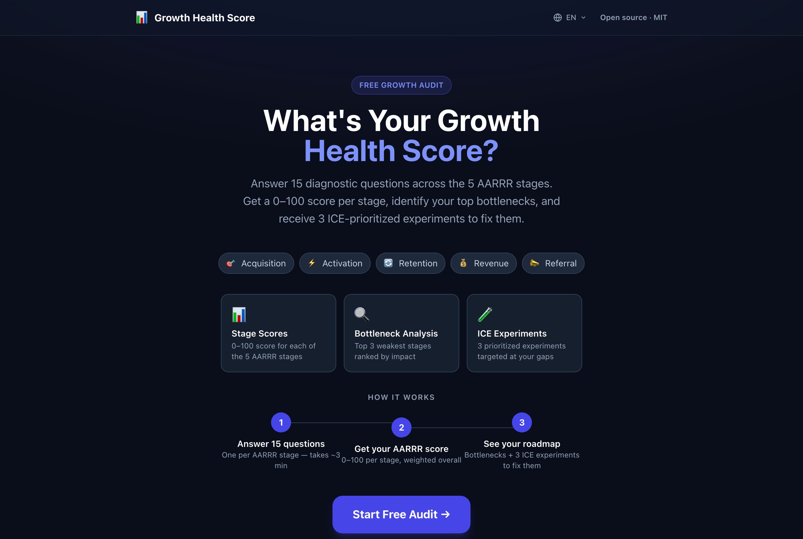
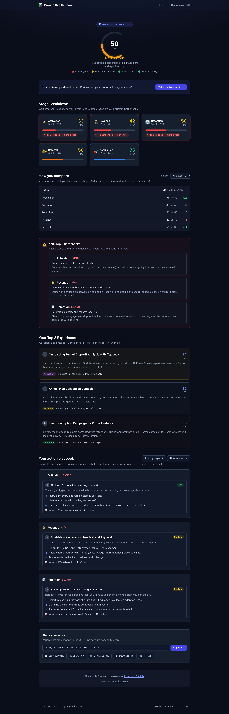
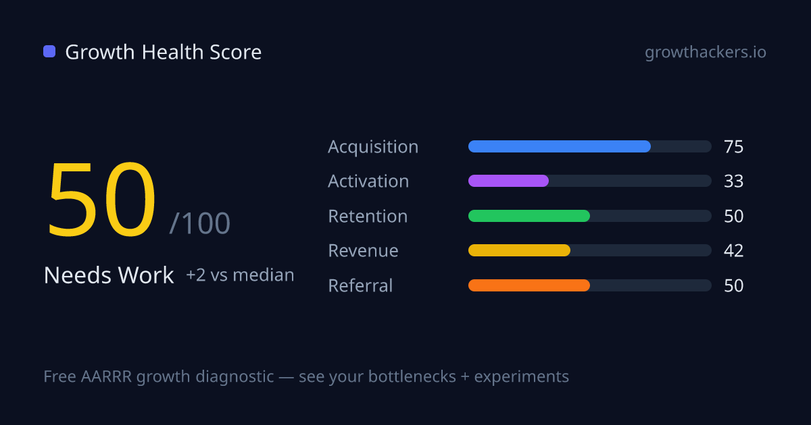
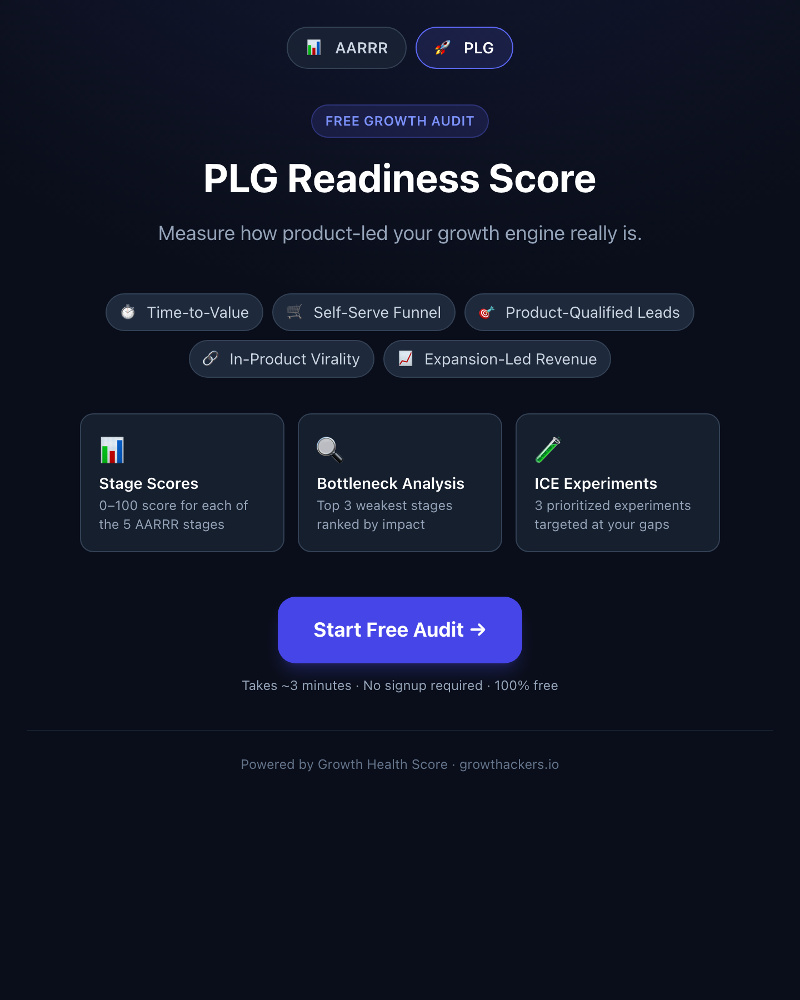

# Growth Health Score — free, zero-backend growth diagnostics

[](https://github.com/aymandakir-gh/gh-growth-score/actions/workflows/ci.yml)
[](LICENSE)
[](https://github.com/aymandakir-gh/gh-growth-score)

**Diagnose your growth engine in 3 minutes.** Two free audits on one shared
engine — the **AARRR Growth Health Score** and a **PLG Readiness Score** — each
giving you a 0–100 score per stage, your top bottlenecks, an ICE-prioritized
experiment roadmap, and an **exportable action playbook**.

Built by [GrowthHackers](https://growthackers.io) — free and open-source forever.
**Zero backend, privacy-first**: no database, no PII ever leaves the browser.

**Live demo:** _<!-- add your deployed URL here, e.g. https://growth-score.vercel.app -->_ — deploy your own in one click ↓



> _Screenshots are real and reproducible: `npm run build && npm run screenshot`
> regenerates `docs/screenshot.png`, `docs/results.png`, and `docs/embed.png`._

---

## What you get

- **Two diagnostics, one engine** — switch between the **AARRR** growth audit and
  a **PLG Readiness** audit (Time-to-Value, Self-Serve, Product-Qualified Leads,
  In-Product Virality, Expansion-Led Revenue). Both fully selectable.
- **0–100 score per stage** — weighted by growth-model importance, with a clear
  overall score and label.
- **Bottleneck detection + ICE experiments** — your 3 weakest stages, plus the
  single highest-ICE experiment from each.
- **Actionable playbook** — per-weak-stage tactics with concrete steps, the metric
  to watch, effort, and horizon. **Exportable** as Markdown (and in the PDF).
- **"You vs. median" benchmarks** — per-stage, switchable across **5 industries**
  (All · B2B SaaS · PLG SaaS · Marketplace · Fintech).
- **Built-in growth loop** — shareable result link, auto-generated social preview,
  **PNG and PDF** report export.
- **Embeddable** — drop the audit on any site with one `<script>` tag.
- **9 languages** via `?lang=` (EN, AR-RTL, IT, NL, ZH, ES, FR, DE, PT-BR).



---

## The growth loop

Every result is shareable, and shared links preview the score on social — pulling
new people in to take their own audit.



- **Shareable link, no PII.** Your result is encoded entirely in the URL. AARRR
  uses `?r=1.<15 digits>`; any diagnostic uses the self-describing
  `?r=2.<id>.<digits>` (e.g. `?r=2.plg.342013402230114`). That's the **entire**
  payload — one answer value (0–4) per question, **no email, name, or timestamp**.
  Opening the link recomputes the exact score and breakdown.
- **Dynamic share image.** `app/api/og` renders a branded card from the token via
  `next/og`, so a pasted link previews the score. Stateless — nothing stored.
- **Ungated for recipients.** A shared link shows the full breakdown immediately,
  with a CTA to take your own audit.
- **PNG + PDF report.** One click saves a branded PNG, or a full multi-section
  **PDF** generated entirely client-side (score, breakdown vs. median,
  bottlenecks + recommendations, the playbook, top experiments).

---

## Embed it on your site

One script tag, self-contained, no backend ([full docs →](docs/EMBED.md)):

```html
<script
  src="https://growth-score.growthackers.io/embed.js"
  data-diagnostic="aarrr"
  async
></script>
```

It injects a responsive iframe and auto-resizes it. Options: `data-diagnostic`
(`aarrr` / `plg`), `data-lang`, `data-token` (embed a specific result),
`data-height`, `data-base`.



---

## Quick start

```bash
git clone https://github.com/aymandakir-gh/gh-growth-score.git
cd gh-growth-score && npm install && npm run dev
```

Open [http://localhost:3000](http://localhost:3000). No env vars required — the
app runs fully out of the box. Try `?d=plg`, `?lang=ar`, or `?industry=fintech`.

---

## How the scoring works

Everything is a pure function on the shared engine in
[`lib/engine.ts`](lib/engine.ts). A diagnostic is just data — a `Diagnostic`
descriptor (dimensions + questions + experiments). AARRR lives in
[`lib/scoring.ts`](lib/scoring.ts) and PLG in
[`lib/diagnostics/plg.ts`](lib/diagnostics/plg.ts); both run on the same engine,
share codec, OG/report, PDF, and playbook pipeline.

**1. Answer the questions.** Each question has a 5-point scale, scored `0`
(critical gap) to `4` (best-in-class).

**2. Score each stage (0–100):** `round( sum(answers) / (questions × 4) × 100 )`.

**3. Weight into an overall score.** AARRR weights (sum to 1.0):

| Stage | Weight | | PLG dimension | Weight |
|---|---|---|---|---|
| 🎯 Acquisition | 20% | | ⏱️ Time-to-Value | 25% |
| ⚡ Activation | 20% | | 🛒 Self-Serve Funnel | 25% |
| 🔄 Retention | 25% | | 🎯 Product-Qualified Leads | 15% |
| 💰 Revenue | 25% | | 🔗 In-Product Virality | 15% |
| 📣 Referral | 10% | | 📈 Expansion-Led Revenue | 20% |

**4. Find the bottlenecks** (3 lowest stages) **and prescribe experiments** — the
highest-**ICE** experiment from each, where `ICE = round(Impact × Confidence ÷
Effort)`.

**5. Compare + recommend + plan.** Each stage is compared to an industry median
([`lib/benchmarks.ts`](lib/benchmarks.ts)), each bottleneck gets a tailored
recommendation, and the **playbook** ([`lib/playbook.ts`](lib/playbook.ts))
gives concrete tactics.

> Benchmark medians ([`datasets/benchmarks.md`](datasets/benchmarks.md)) and the
> playbook ([`datasets/playbooks.md`](datasets/playbooks.md)) are
> **honestly-labelled synthesized/editorial content**, not licensed data. Swap in
> your own and the labelling notes how.

---

## The email gate (decision: kept, env-configured, optional)

The OSS build **keeps the email gate but makes it fully optional**, so the tool
works with **zero backend**:

- Submitting `POST`s to `app/api/lead/route.ts`, a server-side proxy that keeps
  `LEADS_API_URL` private. If set, the lead is forwarded; if unset (default), the
  route logs the score only (no PII) and returns `ok` so results still unlock.
- Rate-limited to **10 req/min/IP**. Shared links and the embed are **ungated**.

---

## Deploy to Vercel

[](https://vercel.com/new/clone?repository-url=https://github.com/aymandakir-gh/gh-growth-score)

Turnkey — `vercel.json` is `{ "framework": "nextjs" }`, no required secrets. From
a clone, one command ships it:

```bash
npx vercel --prod
```

Optionally add `LEADS_API_URL`, `NEXT_PUBLIC_SITE_URL`, `NEXT_PUBLIC_SENTRY_DSN`,
`NEXT_PUBLIC_POSTHOG_KEY` in **Project Settings → Environment Variables**. All
optional — the app degrades gracefully when absent.

---

## Tests, CI & quality

```bash
npm test        # 223 unit tests (Vitest)
npm run e2e     # 33 Playwright e2e (needs a build) — 256 tests total
npm run lint
npm run build
npm run screenshot
```

CI ([`.github/workflows/ci.yml`](.github/workflows/ci.yml)) runs **lint → test →
build → e2e** on every push/PR to `main`.

- **Unit:** the shared engine + AARRR parity, both diagnostics, the codec
  (v1/v2/legacy), benchmarks + per-industry depth, recommendations, playbook,
  PDF, share-model, `/api/lead`, rate limiter, i18n + `resolveLocale`, embed
  helpers, `LanguageSelector`.
- **E2E (Playwright + axe):** the share loop (AARRR + PLG), OG/PNG/PDF export,
  the playbook export, the **embeddable widget** (real `embed.js` iframe +
  auto-resize), **i18n** (`?lang=` + Arabic RTL), the **industry switch**, and
  **axe** accessibility scans (WCAG 2.0/2.1 A & AA) on landing, both shared
  results, the embed, and the RTL page — all clean.
- **Lighthouse** (desktop, committed under [`docs/lighthouse/`](docs/lighthouse/SUMMARY.md)):
  **Performance 100 · Accessibility 100 · Best Practices 96 · SEO 100**.

---

## Stack

- **Next.js 14** (App Router) · **TypeScript** · **Tailwind CSS**
- **jsPDF** client-side PDF · **`next/og`** dynamic share images (Edge)
- **Vitest** unit · **Playwright** e2e + axe a11y + screenshots
- **Sentry + PostHog** observability (optional, graceful degrade)
- No external UI libraries — pure Tailwind components

---

## Project structure

```
app/
  page.tsx              # Server component — diagnostic-aware generateMetadata
  embed/page.tsx        # Embeddable widget surface (noindex)
  api/lead/route.ts     # Lead capture proxy (validation + rate limit + fallback)
  api/og/route.tsx      # Dynamic share card (next/og, Edge) — diagnostic + industry aware
lib/
  engine.ts             # Generic pure scoring core — every diagnostic runs on this
  scoring.ts            # AARRR diagnostic (descriptor + back-compat API) → delegates to engine
  diagnostics/          # plg.ts (PLG Readiness) + index.ts (registry + share codec)
  benchmarks.ts         # Per-diagnostic × per-industry medians + comparison
  recommendations.ts    # Per-dimension tailored advice by band
  playbook.ts           # Band-aware tactics + Markdown export
  pdf-report.ts         # Client-side PDF (jsPDF), pure → node-testable
  share-model.ts        # Pure view-model for OG/PDF (diagnostic + industry aware)
  embed.ts              # Pure embed-loader helpers (mirrored by public/embed.js)
  i18n.ts / i18n-context.tsx  # 9 locales, ?lang=-driven (never localStorage)
components/             # HomeClient, GrowthQuiz, ResultsDashboard, PlaybookSection, ShareCard, …
public/embed.js         # Self-contained embeddable-widget loader
datasets/               # benchmarks.md + playbooks.md (documented, honestly-labelled)
e2e/                    # Playwright specs (loop, diagnostics, playbook, pdf, embed, i18n, benchmarks, a11y)
```

---

## Add your own diagnostic

A diagnostic is data. Add a `Diagnostic` descriptor (dimensions + questions +
experiments) and register it in `lib/diagnostics/index.ts`. The engine, codec,
OG/report, PDF, playbook, benchmarks, and i18n all pick it up. A descriptor
integrity test (`lib/engine.test.ts`) enforces weights sum to 1, 5 options per
question, unique ids, and a non-empty experiment bank per dimension.

---

## License

MIT — use it, fork it, white-label it. Attribution appreciated, not required.

Built with care by [GrowthHackers](https://growthackers.io).
